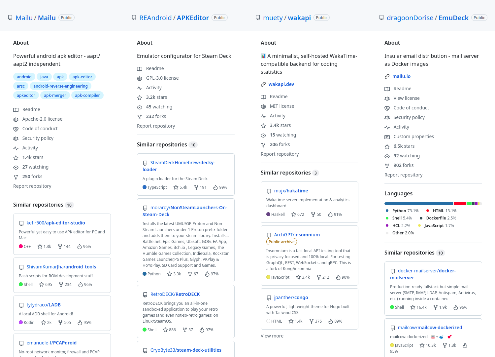

<h1 align="center" style="color:red;">⚠️ NOVEMBER MAINTAINANCE ⚠️</h1>

The API will be down for a few days as I'm moving my server to a new location. This project is still maintained, please do not open issues about this.

# SimRepo

[link-rgh]: https://github.com/sindresorhus/refined-github
[link-ngh]: https://github.com/sindresorhus/notifier-for-github
[link-hfog]: https://github.com/sindresorhus/hide-files-on-github
[link-tsconfig]: https://github.com/sindresorhus/tsconfig
[link-options-sync]: https://github.com/fregante/webext-options-sync
[link-cws-keys]: https://github.com/fregante/chrome-webstore-upload-keys
[link-amo-keys]: https://addons.mozilla.org/en-US/developers/addon/api/key

> Enhances GitHub by showing similar projects in a repository's sidebar

## Features

- [x] Provides similar repositories for all repositories with more than 150 stars
- [x] Adds recommendations on your home page based on your latest stars
- [ ] Recommends new elements for a specific star list

## Installation

<!--

-->

## Technical details

Recommendations are generated by locating the nearest neighbors of a given repository within a vector space, where similar repositories are positioned close to each other. This vector space was built by training an SVC model on a large dataset containing over 300 million GitHub stars. To keep the model up-to-date, the dataset is refreshed incrementally — one-twelfth is updated each month.

Although recommendations were generated locally at first, some users experienced serious performance issues. Hence, I moved the recommendation engine to a server running [Qdrant](https://qdrant.tech/), a vector database. Qdrant implements lookup techniques more efficient than the brute-force I implemented initially. This allows getting fast results without impacting user's machines.

## Contributing

This extension is licensed under GPL v3. See [CONTRIBUTING.md](https://github.com/Mubelotix/SimRepo/blob/main/CONTRIBUTING.md) to get started!

