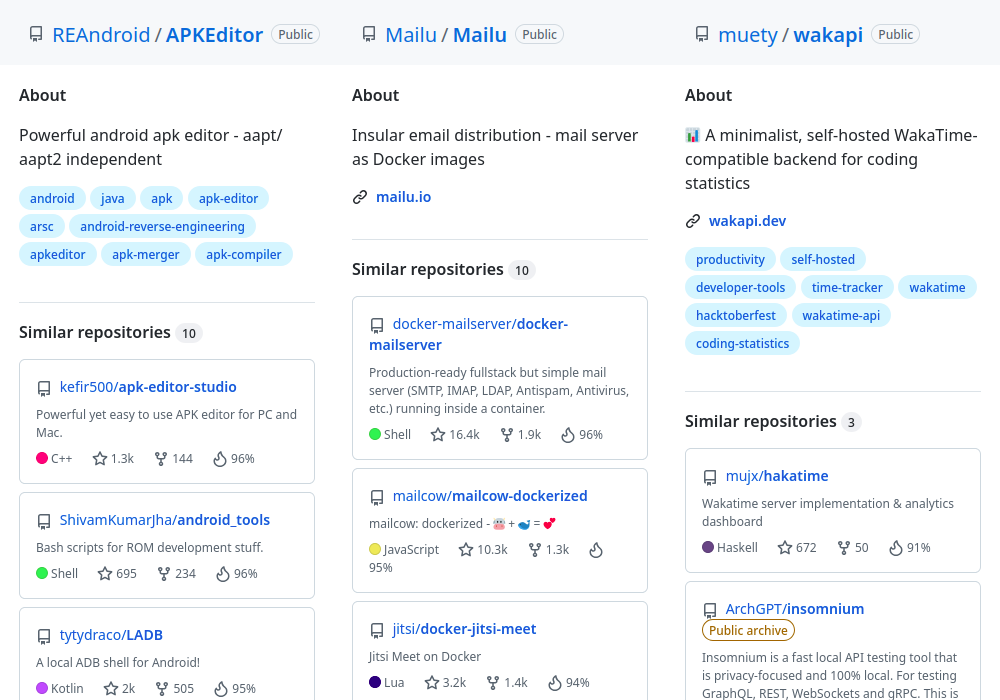

# browser-extension-template

[link-rgh]: https://github.com/sindresorhus/refined-github
[link-ngh]: https://github.com/sindresorhus/notifier-for-github
[link-hfog]: https://github.com/sindresorhus/hide-files-on-github
[link-tsconfig]: https://github.com/sindresorhus/tsconfig
[link-options-sync]: https://github.com/fregante/webext-options-sync
[link-cws-keys]: https://github.com/fregante/chrome-webstore-upload-keys
[link-amo-keys]: https://addons.mozilla.org/en-US/developers/addon/api/key

> Browser extension showing similar repositories on GitHub. 

Screenshot of extension:

## Features

- Uses Manifest v3
- Use npm dependencies thanks to Parcel 2.
- [Auto-syncing options](#auto-syncing-options).
- [Auto-publishing](#publishing) with auto-versioning and support for manual releases.

## Installation

<!--  -->
<!--  -->
<!--  -->
<!--  -->
<!--  -->
<!--  -->
<!--

-->

## Getting started

### Requirements

- Node and npm installed
- An UNIX-like operating system

### 🛠 Build locally

1. Run `npm install` to install all required dependencies
2. Run `npm run build`

The build step will create the `distribution` folder, this folder will contain the generated extension.

### 🏃 Run the extension

Using [web-ext](https://extensionworkshop.com/documentation/develop/getting-started-with-web-ext/) is recommended for automatic reloading and running in a dedicated browser instance. Alternatively you can load the extension manually (see below).

1. Run `npm run watch` to watch for file changes and build continuously
2. Run `npm install --global web-ext` (only only for the first time)
3. In another terminal, run `web-ext run -t chromium`
4. Check that the extension is loaded by opening the extension options ([in Firefox](media/extension_options_firefox.png) or [in Chrome](media/extension_options_chrome.png)).

#### Manually

You can also [load the extension manually in Chrome](https://www.smashingmagazine.com/2017/04/browser-extension-edge-chrome-firefox-opera-brave-vivaldi/#google-chrome-opera-vivaldi) or [Firefox](https://www.smashingmagazine.com/2017/04/browser-extension-edge-chrome-firefox-opera-brave-vivaldi/#mozilla-firefox).
